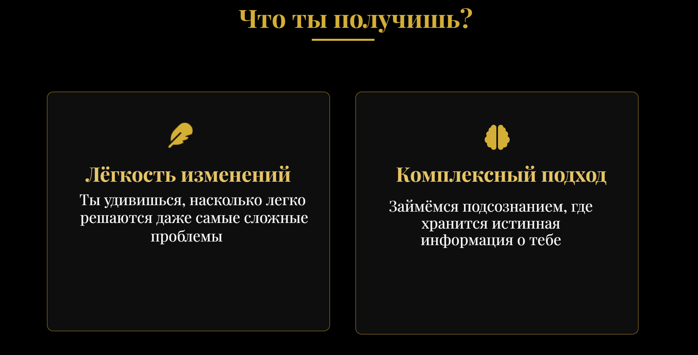

# HypnoShaman - Мистический дизайн для гипнотерапевта

## О проекте

Дизайн-концепт персонального сайта для Дарьи Шамановой — гипнотерапевта и регрессолога. Создал уникальную визуальную атмосферу, сочетающую эзотерическую эстетику с современным веб-дизайном.

## Ключевые особенности дизайна

### 1. Мистическая цветовая палитра
- Основные цвета: глубокий чёрный (#000) и золотой (#D4AF37)
- Дополнительные оттенки: тёмно-золотой (#B8860B), светлое золото (#E6C567)
- Контрастные акценты для важных элементов

### 2. Тематические визуальные элементы
- Эффекты свечения и переливов для золотых элементов
- Текстуры, напоминающие старинный пергамент

### 3. Атмосферные фоны
- Затемнённые изображения с эффектом "тайны"
- Градиентные наложения для создания глубины
- Полупрозрачные элементы для мистического ощущения

### 4. Типографика с характером
- Акцентные элементы с золотым свечением

## Скриншоты интерфейса

[]  
[]  
[]  
[]  
[]  
[]  
[]

## Особенности моего дизайна

1. **Погружающая атмосфера**  
   Создал ощущение таинственности, соответствующее тематике гипноза и регрессологии.

2. **Адаптивная вёрстка**  
   Дизайн одинаково эффектно смотрится на всех устройствах — от смартфонов до широкоформатных мониторов.

3. **Интерактивные элементы**  
   - Плавные анимации при наведении
   - Динамическая галерея сертификатов
   - Эффекты "оживления" интерфейса

4. **Продуманная UX-структура**  
   Чёткая последовательность блоков, ведущая посетителя к целевым действиям.

5. **Авторские графические решения**  
   Уникальные комбинации элементов, создающие узнаваемый стиль.

Дизайн успешно передаёт профессионализм специалиста и создаёт доверительную атмосферу для потенциальных клиентов.
